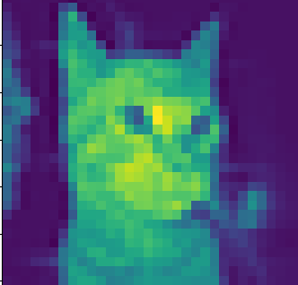
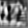
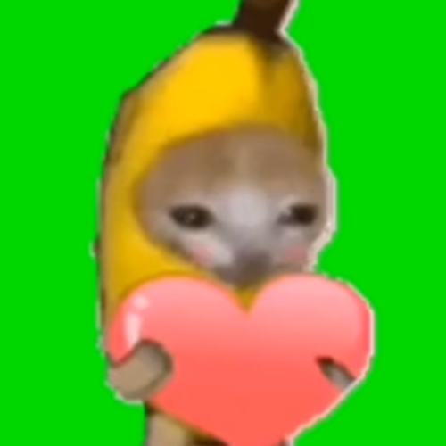

# Cat(G)AN

(Credit: TF Code inspiration from [nicknochnack](https://github.com/nicknochnack))

A 3.5 million parameter GAN I built from scratch in Tensorflow to generate cat (and dog) images. The corresponding math is annotated in the notebook itself and follows the standard GAN formulation based on trying to minmax the Jensen-Shannon Divergence (JSD) using binary cross entropy as our loss function for both the generator and the discriminator.

After 15 epochs:
The final discriminator loss was: 0.681
The final generator loss was: 0.865

Based on other GANs, we should expect to see more discernible patterns after 500 epochs, but I neither have the computing resources nor the Colab credits to run it in a reasonable amount of time. But even at epoch 15, we can see it has already started to do better than random noise

Epoch 0: Generator has no idea what it's doing

Epoch 15: Generator seems to be generating some kind of pattern

Epoch 500+: Hopefully what you saw in the title image if I could actually run it T_T

